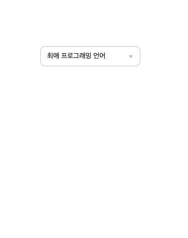

# Dropdown Selectbox

- 멋쟁이사자처럼 프론트엔드 스쿨 과제

## 1. 목표

- 기존의 select box 에서 벗어난 dropdown selectbox를 구현하는 것 뿐만 아니라, 기존의 select box의 기능까지 구현해내는 것
- Figma를 사용해 마음대로 만드는 것이 아닌 디자이너 분이 전해준 디자인을 그대로 구현하는 것

## 2. 개발언어 및 배포

### 2.1 개발언어

- HTML Living Standard
- CSS
- JavaScript

### 2.2 배포

- Github Pages 사용
- https://alstjr5949.github.io/dropdownSelectBox/

## 3. Preview

## 4. 메인 기능

- 언어 리스트 선택시 slect button의 inner text가 변경되는 기능
- select button 클릭시 list box에 class toggle을 통한 hidden 기능

## 5. 개발하며 어려웠던 점

- 우선 퍼블리싱 과정이 조금 어려웠다. 아직은 정렬에 익숙하지 않은점도 있지만 예전에는 만능 flex 주의 였던 내가 적재적소에 그에 맞는 tag를 사용하며 마크업을 짜고, 정렬 또한 float와 flex, text-align 등 여러가지 방법들을 고민하면서 하니까 조금 오래 걸렸던 것 같다.
- 그리고 js 부분에서 처음에는 li를 document.querySelector를 통해서 가져왔다가 후에 select button의 inner text를 변경하는 기능을 구현할 때 Python, 즉 첫번째 리스트만이 그 기능이 구현되는 문제를 직면하게 되었다. 이 부분의 해결방법으로 첫번째로 시도해본 방법은 querySelectorAll이었는데 querySelectorAll을 잘못알고 있었던 것 같다. 그저 괄호 안 클래스네임이나, 태그네임을 가진 모든 요소를 그냥 가져온다고만 생각했는데 구글링을 통해 알아보니 querySelectorAll은 nodeList를 반환해주기 때문에 for문을 사용해야 한다. 하지만 조금 코드가 복잡해지는 감이 있어서 다른 해결방법을 찾아보았고, ul에 클릭이벤트를 줘서 event.target.nodeName이 button인 경우에만 기능이 구현되게 함수를 짰다.
